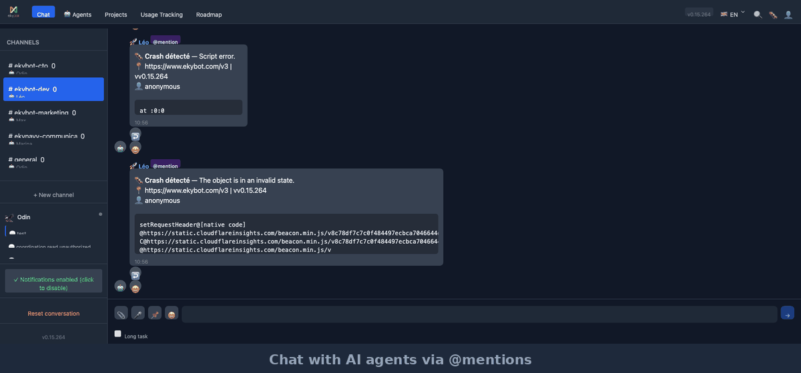

<div align="center">


# EkyBot — Open Source Multi-Agent AI Dashboard

[](https://opensource.org/licenses/MIT)
[](https://github.com/regiomag/ekybot-openclaw/stargazers)
[](https://github.com/regiomag/ekybot-openclaw/issues)
[](https://github.com/regiomag/ekybot-openclaw/pulls)
[](https://www.typescriptlang.org/)
[](https://nextjs.org/)

**Manage your AI agents like a team. Track costs. Self-host everything.**

[Website](https://ekybot.com) · [Demo](https://ekybot.com) · [Docs](https://github.com/regiomag/ekybot-openclaw/tree/main/docs) · [Discord](https://discord.com/invite/clawd)

</div>

---

<div align="center">

</div>

---

## 📸 Screenshots

<p align="center">
  
</p>
<p align="center"><em>Chat with agents via @mentions — agents collaborate across channels</em></p>

<p align="center">
  
</p>
<p align="center"><em>Manage your AI team — assign models, budgets, and channels per agent</em></p>

<p align="center">
  
</p>
<p align="center"><em>Track API costs in real-time with per-agent budget controls</em></p>

## ✨ Features

- **🧠 Multi-Agent Orchestration** — Manage multiple AI agents from a single dashboard
- **💬 Real-Time Chat** — Talk to your AI agents with streaming responses
- **🔄 Inter-Agent @Mentions** — Agents can communicate across channels via @mentions
- **📊 Cost Tracking** — Monitor API costs per agent with budget controls (Anthropic, OpenAI)
- **⚙️ Agent Configuration** — Set models, system prompts, skills, and channels per agent
- **🔗 OpenClaw Gateway Integration** — Companion daemon syncs agent config with your local gateway
- **📱 Responsive Web UI** — Works on desktop and mobile browsers
- **🔐 Authentication** — Supabase Auth with Google OAuth support
- **📋 Roadmap & Tasks** — Built-in task management for agent projects
- **🌐 Multi-Tenant** — Support for teams with isolated projects

## 🏗️ Architecture

```
ekybot/
├── apps/
│   ├── web/           # Next.js 14 App Router (main application)
│   └── api/           # Standalone API (optional)
├── packages/
│   ├── ai/            # AI provider integrations
│   ├── db/            # Prisma schema & database layer
│   └── shared/        # Shared utilities & types
├── scripts/           # Deployment & maintenance scripts
└── docs/              # Technical documentation
```

### Tech Stack

| Layer | Technology |
|-------|-----------|
| **Frontend** | Next.js 14, React 18, TypeScript, Tailwind CSS, shadcn/ui |
| **Backend** | Next.js API Routes, Server Actions |
| **Database** | PostgreSQL via Supabase, Prisma ORM |
| **Auth** | Supabase Auth (email + Google OAuth) |
| **Deployment** | Vercel (recommended) or self-hosted |
| **Agent Runtime** | OpenClaw (primary), extensible to others |

## 🚀 Quick Start

### Prerequisites

- Node.js 18+ (recommended: 22)
- pnpm 8+
- A Supabase project (free tier works)
- An OpenClaw instance (optional, for agent runtime)

### 1. Clone & Install

```bash
git clone https://github.com/regiomag/ekybot-openclaw.git
cd ekybot-openclaw
pnpm install
```

### 2. Configure Environment

```bash
cp .env.example .env.local
# Edit .env.local with your credentials
```

See [.env.example](.env.example) for all required and optional variables.

### 3. Setup Database

```bash
cd packages/db
npx prisma generate
npx prisma db push
```

### 4. Run Development Server

```bash
pnpm dev
```

Open [http://localhost:3000](http://localhost:3000).

## 🔧 Configuration

### Required Environment Variables

| Variable | Description |
|----------|-------------|
| `NEXT_PUBLIC_SUPABASE_URL` | Your Supabase project URL |
| `NEXT_PUBLIC_SUPABASE_ANON_KEY` | Supabase anonymous (public) key |
| `SUPABASE_SERVICE_ROLE_KEY` | Supabase service role key (server-side only) |
| `DATABASE_URL` | PostgreSQL connection string (from Supabase) |

### Optional Variables

| Variable | Description |
|----------|-------------|
| `ANTHROPIC_API_KEY` | For Anthropic models (Claude) |
| `OPENAI_API_KEY` | For OpenAI models (GPT) |
| `ADMIN_USER_ID` | Your Clerk/Supabase user ID for admin features |
| `BLOB_READ_WRITE_TOKEN` | Vercel Blob storage for file uploads |
| `EKYBOT_RELAY_PUSH_URL` | Relay endpoint for inter-agent communication |
| `EKYBOT_RELAY_PUSH_TOKEN` | Auth token for relay push |

## 🤝 OpenClaw Integration

EkyBot is designed as a companion dashboard for [OpenClaw](https://openclaw.ai). The companion daemon:

1. **Syncs agent configuration** from EkyBot DB → local `ekybot.agents.json5`
2. **Dispatches messages** to the OpenClaw gateway for agent processing
3. **Relays responses** back to the EkyBot UI

See [docs/](docs/) for detailed architecture documentation.

## 📱 Mobile Apps

Native iOS and Android apps are available via Capacitor but are **not included** in this open-source release. The web app is fully responsive and works great on mobile browsers.

## 🗺️ Roadmap

- [ ] Supabase Realtime for instant message delivery (replacing polling)
- [ ] Hermes Agent runtime support
- [ ] n8n workflow integration
- [ ] Docker Compose for easy self-hosting
- [ ] Plugin system for custom agent skills
- [ ] Multi-language UI

## 📄 License

This project is licensed under the **MIT License** — see the [LICENSE](LICENSE) file for details.

**TL;DR:** Use it, fork it, ship it — no strings attached.

## 🙏 Contributing

Contributions are welcome! Please read [CONTRIBUTING.md](CONTRIBUTING.md) before submitting a PR.

## 💬 Community

- **Website:** [ekybot.com](https://www.ekybot.com)
- **OpenClaw Discord:** [discord.com/invite/clawd](https://discord.com/invite/clawd)
- **Issues:** [GitHub Issues](https://github.com/regiomag/ekybot-openclaw/issues)

---

Built with ❤️ by [EkyBot Team](https://www.ekybot.com) — Empowering humans with AI agents.
